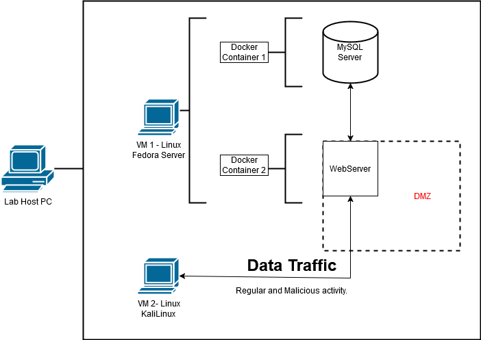

---

# UNDER CONSTRUCTION
Still organizing the environment and project goals.

 

# [ Initial Hopes and Dreams ]

This is still under construction as I learn the different methods a webapp can be deployed, I plan on documenting the journey of securing it!

   Once I get more comfortable deploying, I will begin security hardening of all facets of the project along with some penetration testing to simulate attacks. This project is ongoing, with continuous updates to track improvements in security controls over time. Ideally I set up a database that can store user login information, possibly more, anything to get a foundation of authenticated users. I aim to keep a chronological log of milestones/security controls implemented to identify where an unsecure software has gone from baseline, to it's current more secure state.

Here is a rough outline of ideas -> [Rough Project Outline](github_docs/outline.md)

This is a rough idea for my project initial unsecure architecture. I would like to represent more as I plan on adding controls that can fit nicely on the chart (like firewalls, IDS/IPS, etc.) but changes to things like code structure (to protect against SQL inject, XSS, etc.) I am unsure where to fit that in documents, but I'll address that once I actually begin modifying the code.

---

