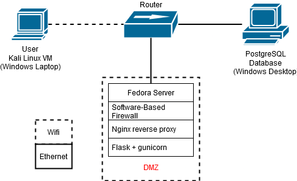

---

# Archived
This idea of utilizing python to facilitate a web service is something that I continue to shape future projects with so this was more of a stepping-stone.

 

  
<h1>[ Initial Hopes and Dreams ]</h1>

This is still under construction as I learn the different methods a webapp can be deployed, I plan on documenting the journey of securing it!

   Once I get more comfortable deploying, I will begin security hardening of all facets of the project along with some penetration testing to simulate attacks. This project is ongoing, with continuous updates to track improvements in security controls over time. Ideally I set up a database that can store user login information, possibly more, anything to get a foundation of authenticated users. I aim to keep a chronological log of milestones/security controls implemented to identify where an unsecure software has gone from baseline, to it's current more secure state.

Here is a rough outline of ideas -> [Rough Project Outline](github_docs/outline.md)

 

## Network Infrastructure

This is a rough idea for my project initial unsecure architecture. I would like to represent more as I plan on adding controls that can fit nicely on the chart (like firewalls, IDS/IPS, etc.) but changes to things like code structure (to protect against SQL inject, XSS, etc.) I am unsure where to fit that in documents, but I'll address that once I actually begin modifying the code.

 

  
<h1>[ Jan. 21, 2025 ]</h1>

  Here is an updated network architecture diagram that is a bit more accurate. I will be switching from mySQL to PostgreSQL for scalibility (and mySQL was not working with my environment initially). I will also be adding nginx for a rerverse proxy, and then gunicorn for the web app hosting with Flask all on one device. I have to learn all of these still in order to deploy them in it's entirety but I still think this foundation will be easier to modify as I implement security features. There are now multiple physical devices at play and will facilitate my lab network.

 

